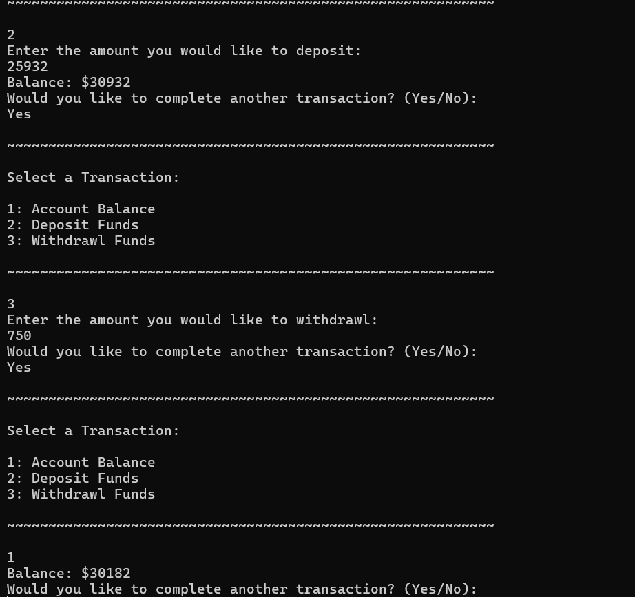

# ATM_System

# Description
A simple C++ application to simulate the processes involved with using an ATM. The purpose of this project is to serve as refresher to classes an objects, which are the main components of object oriented programming.

# Features
1. Get account balance
2. Deposit funds
3. Widthdrawl funds
4. Make additional transactions within one session

   
   

# Technical
C++ 14 Standard
Visual Studio 2022

   
